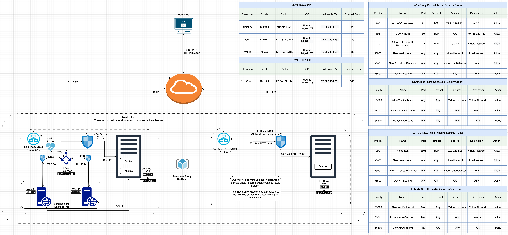

## Automated ELK Stack Deployment

The files in this repository were used to configure the network depicted below.



These files have been tested and used to generate a live ELK deployment on Azure. They can be used to either recreate the entire deployment pictured above. Alternatively, select portions of the playbook file may be used to install only certain pieces of it, such as Filebeat.

Playbook File 1: my-playbook.yml

```yaml
---
  - name: My first playbook
    hosts: webservers
    become: true
    tasks:

    - name: docker.io
      apt:
        update_cache: yes
        name: docker.io
        state: present

    - name: install pip3
      apt:
        force_apt_get: yes
        name: python3-pip
        state: present

    - name: Install Docker python module
      pip:
        name: docker
        state: present

    - name: download and launch a docker web container
      docker_container:
        name: dvwa
        image: cyberxsecurity/dvwa
        state: started
        restart_policy: always
        published_ports: 80:80

    - name: Enable docker service
      systemd:
        name: docker
        enabled: yes
```

Playbook File 2: install-elk.yml

```yaml
---
  - name: ELK Server installation
    hosts: elk
    become: true
    tasks:

    - name: docker.io
      apt:
        update_cache: yes
        name: docker.io
        state: present

    - name: install pip3
      apt:
        force_apt_get: yes
        name: python3-pip
        state: present

    - name: Install Docker python module
      pip:
        name: docker
        state: present

    - name: Enable docker service
      systemd:
        name: docker
        enabled: yes

    - name: Memory Expansion
      sysctl:
        name: vm.max_map_count
        value: 262144
        state: present
        reload: yes

    - name: Docker Container Installation
      docker_container:
        name: elk
        image: sebp/elk:761
        state: started
        restart_policy: always
        published_ports:
         - 5601:5601
         - 9200:9200
         - 5044:5044
```

Playbook File 3: filebeat-playbook.yml

```yaml
---
- name: installing and launching filebeat
  hosts: webservers
  become: yes
  tasks:

  - name: Download filebeat deb
    command: curl -L -O https://artifacts.elastic.co/downloads/beats/filebeat/filebeat-7.6.1-amd64.deb

  - name: Install filebeat deb
    command: sudo dpkg -i filebeat-7.6.1-amd64.deb

  - name: Drop in filebeat.yml
    copy:
      src: /etc/ansible/files/filebeat-config.yml
      dest: /etc/filebeat/filebeat.yml

  - name: Enable and configure system module
    command: sudo filebeat modules enable system

  - name: Setup filebeat
    command: sudo filebeat setup

  - name: Start filebeat service
    command: sudo service filebeat start

  - name: Enable service filebeat on boot
    systemd:
      name: filebeat
      enabled: yes
```

Playbook File 4: metricbeat-playbook.yml

```yaml
---
- name: Install metric beat
  hosts: webservers
  become: true
  tasks:
    # Use command module
  - name: Download metricbeat
    command: curl -L -O https://artifacts.elastic.co/downloads/beats/metricbeat/metricbeat-7.6.1-amd64.deb

    # Use command module
  - name: install metricbeat
    command: dpkg -i metricbeat-7.6.1-amd64.deb

    # Use copy module
  - name: drop in metricbeat config
    copy:
      src: /etc/ansible/files/metricbeat-config.yml
      dest: /etc/metricbeat/metricbeat.yml

    # Use command module
  - name: enable and configure docker module for metric beat
    command: sudo metricbeat modules enable docker

    # Use command module
  - name: setup metric beat
    command: sudo metricbeat setup

    # Use command module
  - name: start metric beat
    command: sudo service metricbeat start

    # Use systemd module
  - name: enable service metricbeat on boot
    systemd:
      name: metricbeat
      enabled: yes
```

This document contains the following details:

- Description of the Topology
- Access Policies
- ELK Configuration
  - Beats in Use
  - Machines Being Monitored
- How to Use the Ansible Build


### Description of the Topology

The main purpose of this network is to expose a load-balanced and monitored instance of DVWA, the D*mn Vulnerable Web Application.

Load balancing ensures that the application will be highly realiable, in addition to restricting access to the network.

- What aspect of security do load balancers protect?
  - Mitigate Denial of Service Attacks (DoS)
- What is the advantage of a jump box?
  - It increases web security.
  - It is very easy to deploy and maintain, since everything will be monitored and deplyed through a single Virtual Machine.

Integrating an ELK server allows users to easily monitor the vulnerable VMs for changes to the network traffic and system files. 

- What does Filebeat watch for?
  - Collects data from the file system. 
- What does Metricbeat record?
  - Collects metric from the ssystem data collected by filebeat. We use this metric to analyze the health of the webservers. 

The configuration details of each machine may be found below.
_Note: Use the [Markdown Table Generator](http://www.tablesgenerator.com/markdown_tables) to add/remove values from the table_.

| Name       | Function   | IP Address | Operating System |
| ---------- | ---------- | ---------- | ---------------- |
| Jump Box   | Gateway    | 10.0.0.4   | Linux            |
| Web-1      | Web server | 10.0.0.7   | Linux            |
| Web-2      | Web server | 1.0.0.9    | Linux            |
| Elk Server | Monitoring | 10.1.0.4   | Linux            |

### Access Policies

The machines on the internal network are not exposed to the public Internet. 

Only the _____ machine can accept connections from the Internet. Access to this machine is only allowed from the following IP addresses:

- Add whitelisted IP addresses: 72.220.194.251

Machines within the network can only be accessed by the jumpbox vm.

- Which machine did you allow to access your ELK VM? What was its IP address?
  - Allow ssh connection of the  jumpbox private IP (10.0.0.4) using port 22 

A summary of the access policies in place can be found in the table below.

| Name       | Publicly Accessible | Allowed IP Addresses |
| ---------- | ------------------- | -------------------- |
| Jump Box   | Yes (ssh:22)        | 72.220.194.251       |
| Web-1      | Yes (HTTP:80)       | 72.220.194.251       |
| Web-2      | Yes (HTTP:80)       | 72.220.194.251       |
| Elk Server | Yes (ssh:22)        | 72.220.194.251       |
| Elk Server | Yes (HTTP:5601)     | 72.220.194.251       |

### Elk Configuration

Ansible was used to automate configuration of the ELK machine. No configuration was performed manually, which is advantageous because...

- What is the main advantage of automating configuration with Ansible?
  - Ansible is inexpensive to deploy since it's open source
  - Ansible is simple to set up and can easily be used to automate complex task. 
  - it's very powerfull and can create compile IT infrastucture in a very quick time. 
  - Ansible doesn't rely on any special software to be deployed on thje clients system. 

The playbook implements the following tasks:

- Use the Ansible `apt` module to install `docker.io` and `python3-pip`;
- Use the Ansible `pip` module to install `docker`;
- Use the Ansible `command` module to increase virtual memory;
- Use the Ansible `sysctl` module to use more virtual memory;
- Use the Ansible `docker_container` module to download and launch Elk container;
- Use the Ansible `systemd` module to enable service docker on boot.

The following screenshot displays the result of running `docker ps` after successfully configuring the ELK instance.


### Target Machines & Beats

This ELK server is configured to monitor the following machines:

- Web-1: 10.0.0.7
- Web-2: 10.0.0.9

We have installed the following Beats on these machines:

- Filebeat
- Metricbeat

These Beats allow us to collect the following information from each machine:

- `Filebeat` collects data about the file system. Filebeat enables analysis to monitor files for suspicious changes. Such as `system Filebeat` module collects and parses logs wrriten by the system logging service of common Unix/Linux based distributions.
- `Metricbeat` collects machine metrics, such as uptime. We are able to use the data from filebeat and the metricbeat to easily and quickly analyze info/transactions from our web servers. 

### Using the Playbook

In order to use the playbook, you will need to have an Ansible control node already configured. Assuming you have such a control node provisioned: 

SSH into the control node and follow the steps below:

- Copy the configuration file to Ansible container.
- Update the the configuration file to include Elk server's IP address, which is 10.1.0.4 in my project.
- Run the playbook, and navigate to the bottom of [http://Elk-server-ip:5601/app/kibana](http://<Elk-server-ip>:5601/app/kibana) and click on **Verify Incoming Data** to check that the installation worked as expected.

- _Which file is the playbook? Where do you copy it?_

  - filebeat-playbook.yml 
  - metricbeat-playbook.yml 
  - I copied into /etc/ansible/files/

- _Which file do you update to make Ansible run the playbook on a specific machine? How do I specify which machine to install the ELK server on versus which to install Filebeat on?_

  - We specify our webserver and our elk server location at the ansible host file. We also mneed to make sure our playbook files are being rederected tot he proper host. We want to install filebeat on our webserver and our elk server at our elk vm (10.1.0.4)

    - ```bash
      [webservers]
      #alpha.example.org
      #beta.example.org
      #192.168.1.100
      #192.168.1.110
      10.0.0.7 ansible_python_interpreter=/usr/bin/python3
      10.0.0.9 ansible_python_interpreter=/usr/bin/python3
      
      [elk]
      10.1.0.4 ansible_python_interpreter=/usr/bin/python3
      ```

      

- Which URL do you navigate to in order to check that the ELK server is running?

  - http://72.220.194.251:5601/app/kibana
